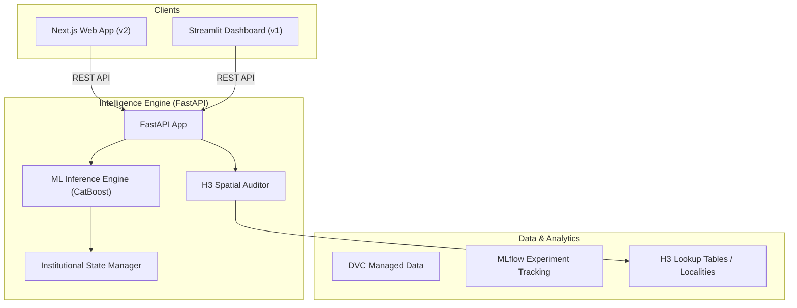

# Architecture: NCR Property Intelligence System

> Generated by Antigravity on 2026-04-03

## Overview
The **NCR Property Intelligence** suite is a decoupled, containerized investment discovery platform. It identifies real estate opportunities in the National Capital Region (Gurgaon, Noida, etc.) using spatial intelligence (H3) and machine learning.

## System Diagram

## Components

### 1. Intelligence Engine (FastAPI)
- **Purpose:** Decoupled backend serving valuations, discovery, and spatial metrics.
- **Location:** `ncr_property_price_estimation/`
- **Key Modules:**
    - `api.py`: Main entry point and router unification.
    - `routes/`: Predict, Discover, Intelligence, and Debug endpoints.
    - `intelligence/`: Core logic for matching and auditing.
- **Dependencies:** `fastapi`, `catboost`, `h3`, `pandas`.

### 2. Web App (Next.js)
- **Purpose:** Premium, institutional-grade user interface for investment discovery.
- **Location:** `web-app/`
- **Key Features:** H3 hotspot visualizations, 3D maps (Deck.gl), sleek "Porter" search.
- **Dependencies:** `next`, `react`, `framer-motion`, `deck.gl`, `lucide-react`.

### 3. Streamlit Dashboard (Legacy/Internal)
- **Purpose:** Rapid visualization and internal market analysis.
- **Location:** `frontend/`
- **Link:** `frontend/app.py`

## Data Flow
1. **User Request:** A client (Next.js or Streamlit) sends a spatial or property query to the FastAPI backend.
2. **State Hydration:** On startup, FastAPI loads institutional state (ML models, locality lookups).
3. **Inference:** The Intelligence Engine runs property data through CatBoost models to predict prices.
4. **Spatial Audit:** Points are clustered using Uber's H3 index to assign value badges (Great Value, etc.).
5. **Response:** Rich JSON payloads are returned to clients for visual rendering.

## Conventions
- **Naming:** Snake_case for Python, PascalCase for React components.
- **Organization:** Modular routers in FastAPI; App Router in Next.js.
- **Spatial:** Strictly uses H3 L8/L9 for micro-market indexing.

## Technical Debt
- [ ] Multiple frontend implementations (Streamlit and Next.js) could lead to diverging logic.
- [ ] DVC data is not directly integrated into the Docker build lifecycle (manual `dvc pull` required).
