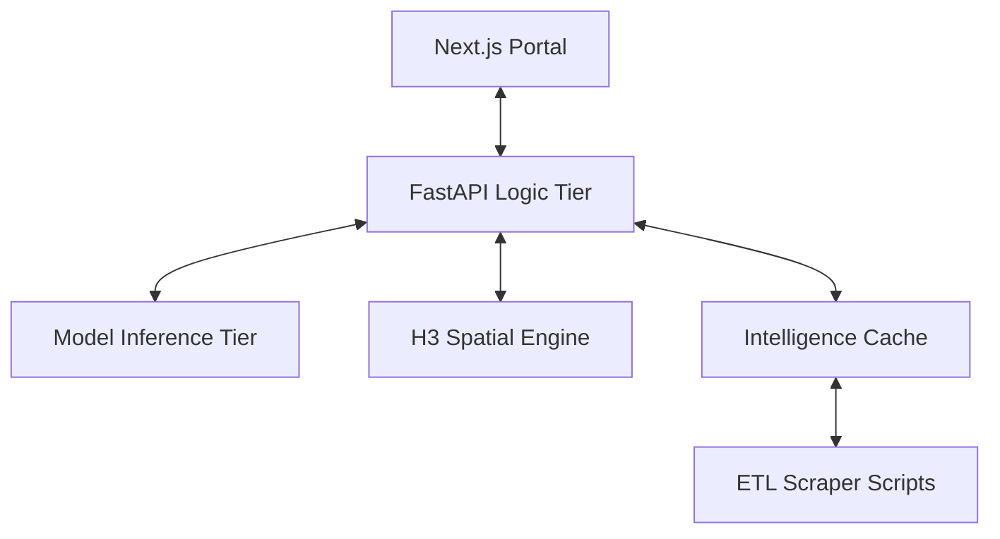

# Architecture: NCR Property Intelligence System

> Generated by codebase-mapper on 2026-04-03

## Overview
A high-performance, institutional-grade real estate analytics engine. The system combines ML-driven price estimation with spatial H3 intelligence to identify investment "alpha" in the National Capital Region (NCR).

## System Diagram

## Internal Components

### 🧠 Intelligence Tier
- **Location**: `ncr_property_price_estimation/intelligence/`
- **ROI Engine**: Calculates rental yields and appreciation vectors.
- **Risk Engine**: Multi-factor risk scoring based on volatility and overvaluation.
- **Scoring Engine**: Unified Alpha Score (0-10) for asset ranking.

### 🗺️ Spatial Tier
- **Location**: `ncr_property_price_estimation/spatial/`
- **H3 Engine**: Handles Resolution 8 hexagonal market clustering and hotspot detection.

### 📡 API Layer
- **Prediction**: `/predict` (Single asset valuation)
- **Institutional Metadata**: `/intelligence/` (Hotspots, alpha assets, market summary)

## Data Flow
1. **Scraping**: `scripts/` populate raw CSVs from market sources.
2. **Inference**: Models in `models/` predict sales and rental price per sqft.
3. **Synthesis**: `IntelligenceEngine` combines ML predictions with ROI formulas.
4. **Delivery**: REST API delivers enriched JSON to the Next.js HUD.

## Conventions
- **Naming**: Snake_case for Python logic, PascalCase for React components, camelCase for API JSON.
- **Units**: Prices in INR (₹), Area in Sqft, Yield in %.
- **Geography**: NCR-exclusive (Gurgaon, Noida, etc.)
