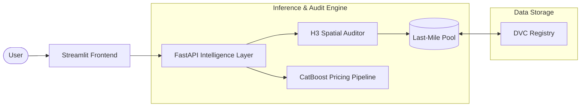

# NCR Property Intelligence 🏙️

The **NCR Property Intelligence** suite is an enterprise-grade investment discovery platform that leverages hyper-local spatial intelligence and machine learning to identify high-yield real estate opportunities across the National Capital Region (Gurgaon, Noida, and Ghaziabad).

## 🚀 Key Production Features

- **AI Investment Auditor**: Every listing is cross-referenced against a **Hyper-Local H3 Spatial Median** to assign visual value badges (🟢 Great Value, Good Deal, Premium).
- **"Best Deal" Discovery**: Aggressive **Alpha-Normalized Deduplication** filters out agent-listing noise, ensuring only the most competitive price variant for any given property is surfaced.
- **Locality Healer**: Integrated neighborhood recovery for Ghaziabad, populating **165+ verified localities** (Indirapuram, Raj Nagar, etc.) that were previously invisible in research datasets.
- **Micro-Market Analysis**: Real-time rental yield and ROI calculations based on localized rental benchmark indices.

---

## 🌐 Live Access

- 🏠 **Investment Dashboard**: [http://13.204.212.148:8501/](http://13.204.212.148:8501/)
- ⚙️ **Intelligence API (Swagger)**: [http://13.204.212.148:8000/docs](http://13.204.212.148:8000/docs)

---

## 📐 System Architecture



## 🏗️ Technical Component Overview

The suite is architected as a decoupled micro-service environment:

1. **Intelligence Engine (`ncr_property_price_estimation/intelligence`)**
   - **H3 Auditor**: Uses Uber's H3 spatial indexing to cluster and benchmark property values.
   - **Engine**: Handles similarity matching and the "Best Deal" priority logic.

2. **Backend API (`FastAPI`)**
   - High-performance layer serving predictions and discovery results.
   - Pydantic-validated endpoints for `/predict`, `/discover`, and `/locality/list`.

3. **Frontend Application (`Streamlit`)**
   - High-fidelity visual dashboard with zero-indentation HTML rendering for premium property cards.
   - Mobile-responsive layout with nested spatial visualizations.

---

## 🗂️ Project Structure

```text
ncr_property_price_estimation/
├── .dvc/                   # Data Version Control metadata
├── .github/workflows/      # CI/CD (GitHub Actions)
├── data.dvc                # Consolidated DVC pointer for the data/ registry
├── frontend/               # UI Dashboard (Streamlit)
│   ├── app.py              # Main frontend logic & CSS
│   └── Dockerfile          # UI container definition
├── models/                 # Serialized ML Artifacts (Tracked by DVC)
├── ncr_property_price_estimation/
│   ├── intelligence/       # AI Auditor & Matching Engine
│   ├── api.py              # FastAPI Service & Endpoints
│   ├── config.py           # Project Configuration
│   └── features.py         # Advanced Feature Pipeline
├── pyproject.toml          # Build configuration
├── Makefile                # Deployment & dev convenience
├── requirements_*.txt      # Frozen dependency manifests
└── README.md               # You are here
```

---

## 🛤️ MLOps & Data Versioning

This project uses a production-hardened data pipeline to ensure reproducibility and high-performance inference.

### 1. Data Version Control (DVC)
Since the property databases and ML artifacts are multi-megabyte files, they are managed via **DVC**.

- **Retrieve Data**: Run `dvc pull` to synchronize the latest production models and geocoding indices.
- **Tracking**: The actual data stays outside of Git, while the `.dvc` pointers are committed to track versions.

### 2. Experiment Tracking
Training experiments, including hyperparameters for the **CatBoost** and **XGBoost** engines, are tracked via **MLflow**.

- **Model Registry**: High-performing pipelines are promoted to the production stage and synced via DVC.

---

## 🔧 Troubleshooting & Diagnostics

We've added advanced diagnostic endpoints to help identify scaling or versioning issues in production.

### Debug Endpoints
- **`GET /health`**: Verifies if the ML models are loaded into memory across the worker pool.
- **`GET /intelligence/hotspots`**: Returns the current localized H3 clusters used by the AI Auditor.

---

## 🔌 API Contract

The backend provides a stable REST interface for property estimations and investment discovery.

### `POST /predict`
Estimates the price and assigns an investment audit for a single property configuration.

**Request Body:**
```json
{
  "city": "Gurugram",
  "sector": "Sector 50",
  "area": 1200.0,
  "bedrooms": 3,
  "bathrooms": 2,
  "prop_type": "Apartment"
}
```

### `POST /discover`
The primary discovery engine for the Investment Marketplace. Surfaces real-world listings matching a search profile, filtered by the **Best Deal** strategy.

---

## 🧪 Testing and CI/CD

The repository includes a comprehensive `pytest` suite for the ML features, pipelines, and FastAPI endpoints.

To run the test suite locally:
```bash
pytest -v
```

---

## 🚀 How to Run Locally

### 1. Environment Setup
```bash
git clone https://github.com/anixes/ncr_property_intelligence_system.git
cd ncr_property_intelligence_system
python -m venv venv
# Windows: venv\Scripts\activate
source venv/bin/activate
pip install -r requirements_production.txt
```

### 2. Pull Production Assets
```bash
dvc pull
```

### 3. Start Services
```bash
# Terminal 1: API
uvicorn ncr_property_price_estimation.api:app --host 0.0.0.0 --port 8000

# Terminal 2: UI
streamlit run frontend/app.py
```

---

## 🗺️ Roadmap

- **[DONE] Property Recommender**: Intelligent engine to surface high-yield alternatives in neighboring sectors.
- **[DONE] Enhanced Scraper**: Production-grade pipelines for Gurgaon, Noida, and Ghaziabad.
- **[NEXT] MLflow Migration**: Transitioning to a shared SQLite-backed MLflow server for multi-agent experimentation.
- **[NEXT] Time-Series Analysis**: adding historical price appreciation charts to the Market Analyzer.
