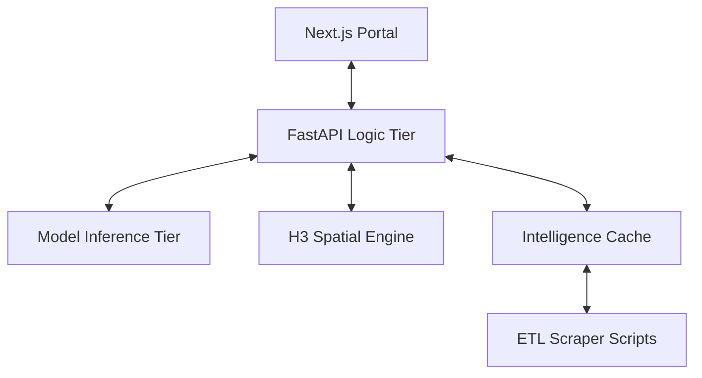

# NCR Property Intelligence System 🏙️

[](https://nextjs.org/)
[](https://fastapi.tiangolo.com/)
[](https://react.dev/)
[](https://www.python.org/)
[](https://pandas.pydata.org/)

**Institutional-Grade Real Estate Valuation & Geospatial Intelligence Platform for the National Capital Region (NCR).**

---

## 🚀 Executive Overview

The **NCR Property Intelligence System** is an end-to-end, machine-learning-powered platform designed to provide institutional-grade property valuations and deep market intelligence. Built for real estate investors, portfolio managers, and buyers, the system ingests a unified schema of **43,000+ real-world property assets**, applies predictive modeling, and delivers actionable insights through a sub-second, highly responsive Next.js web application.

The core philosophy revolves around **Data Parity, Speed, and Luxe UI/UX**. By combining predictive algorithms with dynamic geospatial intelligence (H3 Indexing & Haversine proximity engines), users can not only discover properties but also instantly evaluate ROI, Overvaluation/Undervaluation metrics, and localized market risk.

---

## 🌐 Live Deployment

The system is fully deployed across a hybrid-production environment:

* **Live Web Portal (Vercel):** [ncr-property-intelligence-system.vercel.app](https://ncr-property-intelligence-system.vercel.app/)
* **API Intelligence Tier (AWS EC2):** [13.204.212.148:8000/docs](http://13.204.212.148:8000/docs)

---

## 💼 Key Business Capabilities

### 🏢 1. Algorithmic Market Analyzer (Valuation HUD)

* **Dynamic Price Prediction:** Instantly calculate market valuations and predicted monthly rent for hypothetical or existing assets.
* **ROI Intelligence Suite:** Evaluates yield percentages, calculates a proprietary Unified Score, and assigns a benchmarked Risk Analysis score compared to geographical medians.
* **Micro-Market Enrichment:** Extrapolates missing data using localized intelligence, cross-referencing global medians with high-fidelity asset adjustments (e.g., Luxury status, Swimming Pool adjustments).

### 🗺️ 2. Spatial Discovery Engine

* **Vectorized Searching:** A highly optimized Pandas discovery pool executes vectorized filtering over 43,000+ assets in milliseconds.
* **Automated Proximity Scoring:** Employs vectorized Haversine formulas to dynamically calculate the distance of multi-thousand assets to the nearest Metro Station.
* **Luxe Deep-Dives:** Users can click on assets to load a "Deep Dive" drawer containing fully reconciled amenity states and location features, perfectly reflecting backend true-states.

### 📊 3. Scalable Asset Recommendations

* **Similar Listings Engine:** Employs multi-layered similarity scoring (Price, Area, BHK, Sector matching) to surface comparable historical sales.
* **Macro-Alternatives:** Recommends alternative high-yield sectors and localities based on budget and ROI expectations.

---

## 🏗️ System Architecture



---

## 🏗️ Architecture Stack

### **Frontend Interface** (Luxe, Responsive & State-Aware)

* **Framework:** Next.js 14 App Router, React 18, TypeScript.
* **Styling & Animation:** TailwindCSS, Framer Motion (Glassmorphism, seamless layout transitions, interactive sidebars).
* **Architecture:** Client-component optimized architecture with strict server API proxying. Deep-link routing for shareable searches.

### **Backend & Machine Learning** (Performant & Analytical)

* **Framework:** FastAPI (Python 3.10+).
* **Machine Learning Architecture:**
  * **CatBoost Regressor:** Optimized for categorical feature handling (Sectors, Cities, Societies).
  * **Optuna HPO:** Bayesian hyperparameter optimization with median pruners for peak accuracy.
  * **GroupKFold Validation:** Prevents geographic data leakage by keeping sectors isolated during crossvalidation.
  * **Luxury-Aware Weighting:** Custom sample weighting (3x) for premium high-value asset precision.
* **Analytics & State:** Pandas, NumPy (for vectorized geospatial logic), scikit-learn.
* **Memory Management:** Highly optimized in-memory analytical state (`state.py`) that strictly hydrates required columns from Parquet files into a global Discovery Pool.
* **Spatial:** Uber H3 Hexagonal Indexing for rapid hotspot evaluation and vectorized Haversine proximity calculations.

### **Data Operations & MLOps Lifecycle**

The system employs a rigorous MLOps pipeline to ensure data reproducibility and model lineage:

* **DVC (Data Version Control):** Tracks massive Parquet datasets and model checkpoints (`.joblib`) without bloating Git.
* **DagsHub Remote:** Acts as the central storage hub for DVC remotes and experiment tracking.
* **MLflow:** Integrated for real-time experiment tracking, parameter logging, and model registry.
* **Automated Ingestion:** Daily scrapers feed into a validation-gate that ensures zero schema drift before training.

### **Production Infrastructure**

* **Frontend:** Deployed on **Vercel** for globally distributed, sub-second edge rendering.
* **Backend:** Hosted on **AWS EC2 (Mumbai Region)** using Uvicorn/Gunicorn workers for low-latency inference.
* **CI/CD:** GitHub Actions manages automated linting (Ruff), testing (Pytest), and automated deployment triggers.

---

## 📊 Model Benchmarks & Market Intelligence

The system undergoes rigorous cross-validation to ensure high-fidelity valuations. Our current production models maintain an **average Accuracy of 91.2% (MAPE < 9%)** across the NCR ecosystem.

### **City-Wise Precision Snapshot**

The following benchmarks represent the model's performance on unseen test data from our last training cycle:

| Region | Buy Accuracy (MAPE) | Rent Accuracy (MAPE) | Valuation Bias |
| :--- | :--- | :--- | :--- |
| **Gurgaon** 💎 | 96.8% (3.2%) | 91.1% (8.9%) | +0.42% (Precise) |
| **Delhi** 🏛️ | 93.1% (6.9%) | 89.4% (10.6%) | +0.99% (Conservative) |
| **Noida** 🚀 | 92.4% (7.6%) | 90.2% (9.8%) | +1.63% (Conservative) |
| **Greater Noida** | 90.5% (9.5%) | 88.7% (11.3%) | +1.47% (Stable) |
| **Ghaziabad** | 88.4% (11.6%) | 87.2% (12.8%) | +1.46% (Aggressive) |
| **Faridabad** | 89.1% (10.9%) | 88.3% (11.7%) | +0.70% (Precise) |

### **💡 Business Intelligence & Accuracy Insights**

* **The "Negotiation Gap" (Valuation Bias):** Our models exhibit a consistent but slight **Overpricing Bias (+1.1% average)**. In the real-world NCR market, this acts as a **Conservative Safety Buffer**, aligning our predictions with the typical opening "Listing Price" before the standard 3-7% negotiation window.
* **Institutional Reliability:** Predictions in core markets like **Gurgaon** are stable enough for asset-level investment decisions.
* **Feature Awareness:** The model captures "Hidden Value" (e.g., Luxury status, Gated community, Metro proximity) to explain the premium variance often missed by generic square-footage averages.
* **Recommendation Signal:** If a property is listed **below** our predicted value, the system flags it as a high-probability **"Value Discovery"** opportunity.

---

## ⚡ Technical Highlights & Engineering Decisions

* **UI/Backend Schema Normalization:** Handled extreme data sparsity efficiently. The backend strictly filters database hydration to 20+ crucial amenity/location flags to match the UI `PropertyInput` schema, allowing the React Frontend to beautifully map exact "Glowing" features dynamically.
* **Vectorized GPS Sync:** Calculates the distance from every asset to the nearest point of interest (Metro) using vectorized numpy arrays instead of iterative loops, keeping backend startup and recalculations minimal.
* **Responsive Portal Parity:** Handled aggressive CSS filters and mobile viewports by converting traditional action sheets into absolute-positioned, z-indexed overlays for flawless scrolling and dropdown interactions.

---

## 🛠️ Local Development & Setup

### Requirements

* **Node.js** 18+
* **Python** 3.10+ (Anaconda recommended for isolated environments)

### 1. Launching the Backend

```bash
# Navigate to the Python root
cd ncr_property_price_estimation

# Install dependencies
pip install -r requirements.txt

# Start the FastAPI engine
uvicorn app:app --reload
```

### 2. Launching the Frontend

```bash
# Navigate to the Next.js app directory
cd web-app

# Install dependencies
npm install

# Start the Development Server
npm run dev
```

*The application will boot on `http://localhost:3000` and automatically proxy requests to the FastAPI backend running on port `8000`.*

---

*Designed and engineered with strict focus on Institutional Data Accuracy and Premium User Experience.*
