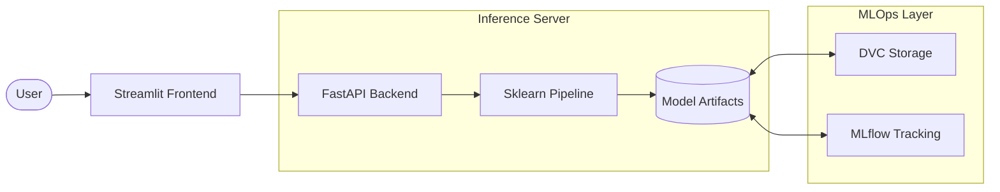

# NCR Property Price Estimator 🏠

A complete end-to-end Machine Learning web application for predicting real estate prices in the National Capital Region (Delhi-NCR) of India.

The project includes an entire ML pipeline: data processing, model training, an exposed **FastAPI** backend for predictions, and a polished **Streamlit** frontend interface.

---

## 📐 System Architecture



## 🏗️ Technical Component Overview

The application consists of three main logical components decoupled for scalability:

1. **Machine Learning Pipeline (`ncr_property_price_estimation/modeling`)**
   - Built with `scikit-learn` pipelines.
   - Includes custom transformers (Log/Winsorizer/Geo-Median Encoders) for robust data preprocessing.
   - The final artifact (`pipeline_v1.joblib`) is version-controlled separately using **DVC** and synced remotely.

2. **Backend API (`FastAPI`)**
   - Serves the serialized ML model via a high-performance REST API.
   - Implements robust Pydantic data validation for all incoming property configurations.
   - Accessible internally by the frontend or externally by 3rd-party services.

3. **Frontend Application (`Streamlit`)**
   - A modern, responsive Python-based UI styled with custom CSS for an enterprise look.
   - Interacts seamlessly with the FastAPI backend over HTTP to fetch and display predictions.

### 🗂️ Project Structure

```text
ncr_property_price_estimation/
├── .dvc/                   # DVC configuration and remote settings
├── .github/workflows/      # CI/CD GitHub Actions (Lint, Test, Docker build)
├── data/                   # Raw & processed data (managed by DVC)
├── debug_pipeline.py       # Diagnostic script for local model validation
├── frontend/               # Streamlit application
│   ├── .streamlit/         # Custom UI theme config
│   ├── app.py              # Main frontend application
│   └── Dockerfile          # Frontend container definition
├── models/                 # ML serialized artifacts (pipeline_v1.joblib tracked by DVC)
├── ncr_property_price_estimation/
│   ├── data/               # Data loading utilities
│   ├── modeling/           # ML pipelines, Custom Transformers (Log, Winsorizer, Geo-Median)
│   ├── api.py              # FastAPI application & endpoints
│   ├── config.py           # Centralized configuration management
│   └── features.py         # Advanced feature engineering
├── notebooks/              # Jupyter notebooks for EDA
├── tests/                  # Pytest suite (Data, API, Features)
├── docker-compose.yml      # Orchestration for API + Frontend
├── Dockerfile              # API container definition
├── Makefile                # Dev convenience scripts
├── requirements_api.txt    # Frozen exact dependencies for the API
└── README.md               # You are here
```

---

## 🛤️ Training Lifecycle & MLOps

The model is trained using a robust pipeline to prevent geographic leakage and ensure generalization across the NCR region.

### 1. Model Training

Run the training suite via:

```bash
python -m ncr_property_price_estimation.modeling.train
```

**Workflow:**

- **Baselines**: Compares Ridge, RandomForest, LightGBM, and XGBoost.
- **Optimization**: Uses **Optuna** for Bayesian optimization (50 trials) with GroupKFold CV.
- **Evaluation**: 5-repeat GroupShuffleSplit validation to estimate true generalization error.
- **Artifacts**: Final model is serialized to `models/pipeline_v1.joblib`.

### 2. Experiment Tracking

All hyperparameters, metrics (RMSE, MAE, R²), and feature importance are logged to **MLflow**.

- **Model Registry**: Training automatically logs the pipeline as an MLflow model.
- **DVC**: The large model artifacts are tracked via Data Version Control (DVC) for reproducible datasets and models.

---

## 🔧 Troubleshooting & Diagnostics

We've added advanced diagnostic endpoints to help identify scaling or versioning issues in production.

### Debug Endpoints

- **`GET /debug/model`**: Returns model hyperparameters and pipeline steps.
- **`GET /debug/geocoder`**: Dumps internal `GeoMedianEncoder` statistics (medians/counts) to verify if the model is using log-scale or raw-scale features.

### Version Alignment
>
> [!IMPORTANT]
> The `xgboost` version in `requirements/api.txt` must strictly match the training environment. Version mismatches (e.g., training in 3.x but serving in 2.x) can result in incorrect or "squashed" (near-zero) predictions.

---

## 🔌 API Contract (V1)

The backend provides a stable REST interface for property estimations.

### `POST /predict`

Estimates the price for a single property configuration.

**Request Body (`application/json`):**

```json
{
  "area": 1200.0,
  "bedrooms": 3,
  "bathrooms": 2,
  "prop_type": "Apartment",
  "city": "Gurugram",
  "sector": "Sector 50",
  "floor": 5,
  "furnished": "Semi-Furnished",
  "facing": "East",
  "lift": 1,
  "parking": 1
}
```

**Response Body:**

```json
{
  "price_per_sqft": 7765.42,
  "estimated_total_price": 9318504.0
}
```

## 💻 Tech Stack

- **Machine Learning**: `scikit-learn`, `pandas`, `numpy`, `xgboost/lightgbm (optional)`
- **Experiment Tracking / MLOps**: `MLflow`, `DVC`
- **Backend**: `FastAPI`, `Uvicorn`, `Pydantic`
- **Frontend**: `Streamlit`, `Requests`
- **Containerization**: `Docker`, `Docker Compose`
- **CI/CD**: `GitHub Actions` (Linting, Test Suite, Docker Image Builds)

---

## 🤖 End-to-End Automation

This project implements a fully automated MLOps pipeline using **GitHub Actions**, **DVC**, and **Docker**.

### 1. Continuous Integration (CI)

On every pull request or push to any branch, the `ci.yml` workflow:

- **Lints** the code using `Ruff`.
- **Tests** the logic using `Pytest`.
- **Smoke Builds** the Docker images using a dummy model artifact to ensure the container structure is valid without waiting for large DVC downloads.

### 2. Continuous Deployment (CD)

On a push to the `main` branch, the `deploy.yml` workflow:

- **Pulls** the actual production model artifact from **DVC** (via DAGsHub).
- **Builds & Pushes** production-ready images to the **GitHub Container Registry (GHCR)**.
- **Deploys** directly to **AWS EC2** via SSH, pulling the latest images and restarting the services using `docker compose`.

---

## 🚀 How to Run Locally

### Approach 1: The Easy Way (Docker Compose)

*Best for running the entire stack (API + Frontend) at once without installing Python dependencies.*

Pre-requisites: Docker & Docker Compose installed.

1. **Clone the repository:**

   ```bash
   git clone https://github.com/anixes/ncr_property_price_estimation.git
   cd ncr_property_price_estimation
   ```

2. **Pull the ML Model (Optional if already checked in to LFS, but required for DVC):**

   ```bash
   dvc pull
   ```

3. **Build and start the services:**

   ```bash
   docker-compose up --build -d
   ```

4. **Access the application:**
   - 🏠 **Streamlit Frontend:** `http://localhost:8501`
   - ⚙️ **FastAPI Swagger Docs:** `http://localhost:8000/docs`

---

### Approach 2: Manual Development Mode

*Best if you want to actively modify code, train models, or run tests.*

1. **Clone and setup a virtual environment:**

   ```bash
   git clone https://github.com/anixes/ncr_property_price_estimation.git
   cd ncr_property_price_estimation
   python -m venv venv
   source venv/bin/activate  # Or `venv\Scripts\activate` on Windows
   ```

2. **Install dependencies:**

   ```bash
   pip install -r requirements_production.txt
   pip install -r requirements_dev.txt
   ```

3. **Start the API:**

   ```bash
   uvicorn ncr_property_price_estimation.api:app --reload
   ```

4. **Start the Frontend (in a new terminal):**

   ```bash
   cd frontend
   python -m streamlit run app.py
   ```

---

## 🧪 Testing and CI/CD

The repository includes a comprehensive `pytest` suite for the ML features, pipelines, and FastAPI endpoints.
Continuous Integration (CI) is configured via **GitHub Actions** (`.github/workflows/ci.yml`) which automatically runs:

1. `ruff` checks and code formatting verification.
2. `pytest` for all unit and integration tests.
3. Tests checking that Docker images (API and Frontend) build successfully.

To run the test suite locally:

```bash
pytest -v
```

To run lint checks:

```bash
ruff check .
ruff format --check .
```

---

## 🗺️ Roadmap (v2)

This current release represents **v1** of the application, focusing on robust price estimation using current market data.

Planned features for **v2**:

- **Property Recommender System**: A new engine to recommend similar available properties based on user preferences and estimated budgets.
- **Enhanced Data Scraper**: Upgraded web scraping pipelines to gather more comprehensive, real-time property data and amenities across a wider radius in the NCR region.
